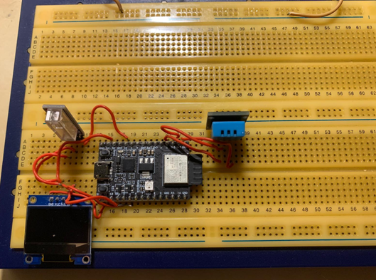

# 🌤️ Wetterstation 2025

> Tamino Beckmann & Marcel Ebner  
> 📅 Abgabedatum: 25.05.2025

## 🔧 Projektübersicht

Im Projekt „Wetterstation 2025“ wurde ein ESP32-Mikrocontroller verwendet, um Temperatur, Luftfeuchtigkeit und Erschütterungen zu messen. Die Werte werden über ein OLED-Display, Webserver, Blynk-App und Discord angezeigt.

## ⚙️ Verwendete Komponenten

- ESP32 Mini C3
- DHT11 Sensor
- B23 Shock Sensor
- OLED-Display (SSD1306)
- RGB-LED
- Webserver mit HTML/JS
- MariaDB + PHP-API
- Discord Webhook
- Blynk App

## 📷 Aufbau

## 🧪 Features

- 🌡 Temperaturmessung (DHT11)
- 💧 Luftfeuchtigkeitsmessung
- 🚨 Erschütterungserkennung (B23 Sensor)
- 🖥️ OLED-Display mit Uhrzeit und Messwerten
- 🌐 Webserver mit Live-Werten & Steuerung
- ☁️ Cloudanbindung über Blynk & Discord
- 🔌 Sleep-Mode für Stromsparen

## 📁 Webserver

Weboberfläche mit Anzeige der Sensordaten und Schaltflächen:

## 💾 Datenbank

Daten werden alle 10 Sekunden in eine MariaDB-Datenbank eingetragen über eine `insert_temp.php`-API.

## 🔴 Status-LED Logik

- 🟢 **Grün** – alles OK  
- 🔴 **Rot** – kein WLAN oder Erschütterung  
- 🟠 **Orange** – Temperatur über 28 °C

## 📱 Discord & Blynk

### Discord-Benachrichtigung (alle 5 Minuten):

### Anzeige & Steuerung per Blynk App:

## 🧠 Sleep Mode

Webgesteuerter Soft-Sleep-Modus: Display und LEDs werden deaktiviert, Sensoren und Netz bleiben aktiv.

---

## 📦 Aufbau & Code

Alle Komponenten wurden modular getestet und am Ende in ein großes Programm zusammengeführt. Die finale Firmware enthält:

- Blynk-Setup
- NTP-Zeitsynchronisation
- HTML-Interface
- Datenlogging + Übertragung

📜 Finaler Code ist im Ordner `src/` oder `main.cpp` enthalten.

## 🧵 Lessons Learned

> „Arbeitet gut und gemeinschaftlich miteinander, denn es ist **EUER Projekt**.“

---

## 🔚 Abschluss

Die vollständige technische Dokumentation mit Codebeispielen, Troubleshooting und Setup-Anleitung findet ihr in `WetterstationProtkoll_BeckmannEbner.pdf`.

